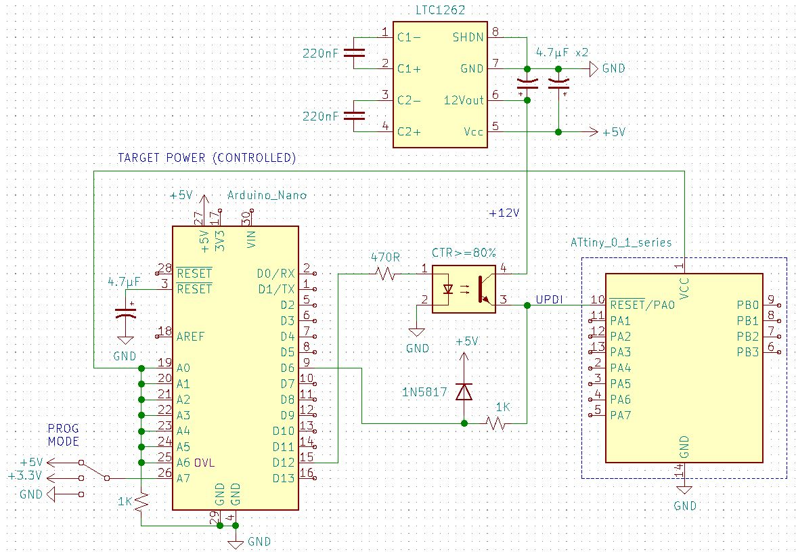

# HV UPDI Programmer
The firmware was downloaded from https://github.com/SpenceKonde/jtag2updi, then updated to add some new features; namely HV programming, target power-cycle, target current overload sensing, operating mode selector and the functional status of the LED.

The development for this has occurred prior to sign-up with GitHub. Development details have been noted [on this forum](https://forum.arduino.cc/index.php?topic=669577.0).

## HV UPDI Programmer Schematic

| A7 Switch | Prog Mode        | PA0 Configurations | HV Pulse | Power Cycle |
| --------- | ---------------- | ------------------ | -------- | ----------- |
| GND       | OFF              | UPDI               | NO       | NO          |
| 3.3V      | HV               | UPDI, RESET        | YES      | NO          |
| 5V        | HV + Power Cycle | UPDI, RESET, GPIO  | YES      | YES         |

**Status Led Operation:**

Changed from indicating when in programming mode to indicating when in communication mode - remains ON if communication fails (press reset to clear).

Also, on startup, will indicate overload status by blinking at 4Hz if current overload was detected (press reset to clear).

**Target Power Cycle:**

The target power cycle , when enabled, will occur just prior to the HV programming sequence and also just after the end of communication mode. Each power cycle OFF duration has been set to 10ms.

**Firmware Status:**

No known issues. 
