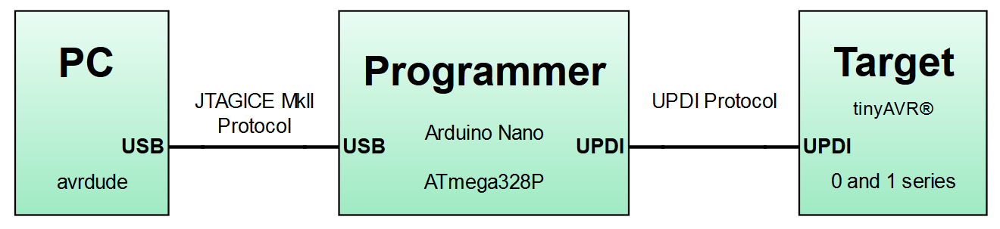

# HV UPDI Programmer
The firmware was downloaded from https://github.com/ElTangas/jtag2updi, then updated to add some new features; namely HV programming, target power-cycle, target current overload sensing, operating mode selector and the functional status of the LED.

The development for this has occurred prior to sign-up with GitHub. Some development details have been noted [on this forum](https://forum.arduino.cc/index.php?topic=669577.0).

## HV UPDI Programmer Schematic

| A7 Switch | Prog Mode | PA0 Configurations | HV Pulse | Power Cycle |
| --------- | --------- | ------------------ | -------- | ----------- |
| GND       | OFF       | UPDI               | NO       | NO          |
| 3.3V      | HV        | UPDI, RESET        | YES      | NO          |
| 5V        | PCHV      | UPDI, RESET, GPIO  | YES      | YES         |

**Status Led Operation:**

Changed from indicating when in programming mode to indicating when in communication mode - remains ON if communication fails (press reset to clear).

Also, on startup, will indicate overload status by blinking at 4Hz if current overload was detected (press reset to clear).

**UPDI Mode:**

This mode would be used when the UPDI pin is configured as UPDI or for any device that isn't HV tolerant.  

**HV Mode:**

This mode applies the 12V UPDI enable sequence (HV pulse) at the start of the programming sequence. This temporarily reconfigures the UPDI/Reset pin to UPDI mode which will remain in this state until the next POR. This allows programming to occur when the pin is configured as Reset. A power on reset (POR) needs to occur for any fuse setting changes to take effect.

**PCHV Mode:**

Power Cycle High Voltage mode (PCHV) will initiate a power cycle and HV pulse at the start of the programming sequence. At the end of the sequence, a second power cycle will occur which causes any new fuse setting to take effect. The power cycle OFF duration has been set to 10ms. This mode would be used when the UPDI/Reset pin is configured as GPIO.

**Firmware Status:**

No known issues. 